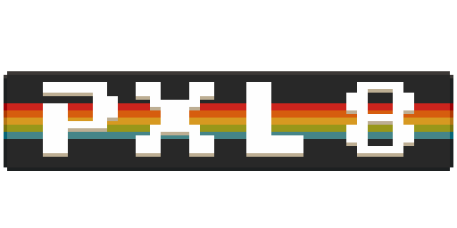

  

**A retro-inspired game development framework; a 💌 to a bygone era.**

`pxl8` is a simple, constraint-based framework designed for making retro games
in the style of the late 1980s/early 1990s era of video games. Built for ease of
integration `pxl8` provides a minimal yet capable API in C inspired by 8-bit and
16-bit hardware.

> **Disclaimer**: This project is under active development. So, ya know, the
> whole *api instability* spiel... :3
